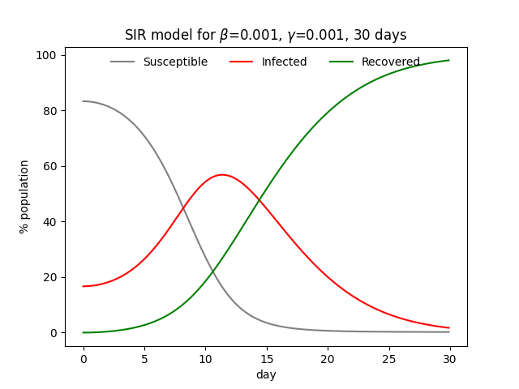

# SIR model

The SIR model computes the evolution of an infectious disease over time.

) - number of susceptible people

) - number of infected people

) - number of recovered people

The model consists of the following system of ODEs:

## Visualization example

