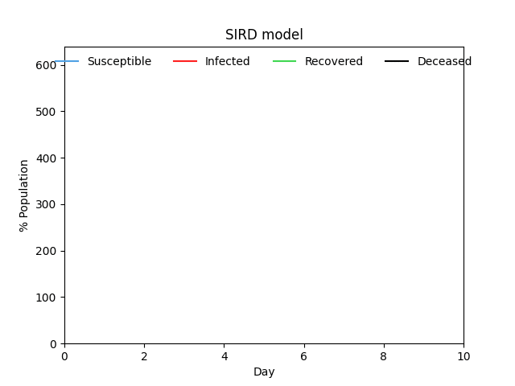

# SIR model

The SIR model computes the evolution of an infectious disease over time.

 - population

) - number of susceptible people

) - number of infected people

) - number of recovered people

) - number of deceased people

 - rate of infection

 - rate of recovery

 - rate of mortality

The model consists of the following system of ODEs:

The system is solved numerically using Euler's method.

## Visualization example

## Article

[Using Mathematical Modeling to Simulate an Epidemic](https://medium.com/towards-artificial-intelligence/using-mathematical-modeling-to-simulate-an-epidemic-2ceaf0c8286d)
